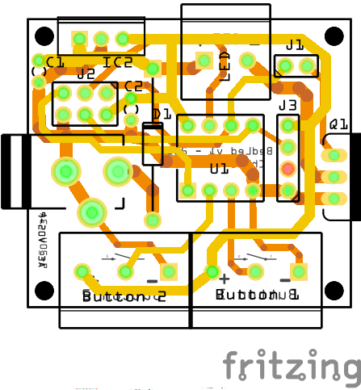

# BedLed

## Schema

Also available on [Aisler](https://aisler.net/qistoph/bedled/)

## Parts
- D1 - Skottky diode (20V, 3A)
- C1 - 16V, 0.33µF
- C2 - 5V, 0.1µF
- IC2 - LM7805
- Q1 - IRFZ44N
- U1 - ATtiny85
- J1 - 2 pin haeder with jumper
- J2 - 2x3 pin ICSP header (optional)
- Power supply socket
- Terminals for button and LED connections
- Buttons
Optional:
- RF expansion (e.g. 433 MHz receiver)
- Reset button (with 2-pin connector)

Connector pins:
- J1, 1 - Pin 6 (PB1, MISO)
- J1, 2 - Q1 gate

J1 - Jumper options:
- 1-2: Pin 6 (PB1) connected to Q1 gate

J2 - ICSP
- 1: MISO
- 2: VCC
- 3: SCK
- 4: MOSI
- 5: RESET
- 6: GND

J3 - RF expansion
- 1: GND
- 2: NC
- 3: Data
- 4: VCC

A serial connection with status/debug info (at 9600 baud) is available on J2-3 (SCK) which is connected to U1-PB2.

## Flashing
To prevent interruptions and blinking the LED strip during flashing:
- Disconnect the MOSFET by removing the jumper on J1 (freeing pin 6 - MISO)
- Remove the RF expansion (freeing pin 5 - MOSI)

## RF (KlikAaanKlikUit) learning mode
To enter the learning mode, hold one of the buttons and press reset. The light will blink twice.
The chip will store 5 addresses.
Pressing the "on" button will add the address, if it's not already added. The light will blink to confirm the action.
Pressing the "off" button will remove the address, if it's a known address. The light will blink to confirm the action.
To earase all learned addresses from memory. Press and hold a button, then reset and keep holding the button until the light blinks 5 times (about 5 seconds). Release the button. The regular learning mode (with an empty memory) is now initiated.
The exit learning mode, press a button once.
